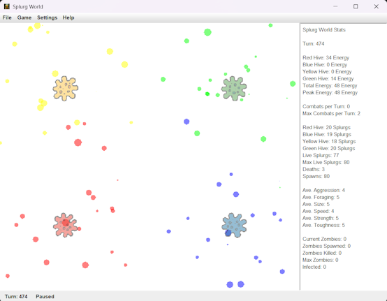

# Splurg World
Splurg world is a simple life simulator where the Splurgs try to live and evolve. \

## What is a Splurg
A Splurg is an asexual Amoeba. \
Splurgs love to fight, eat each other and steal energy from each others Hives, especially the Aggressive ones.

# Stats
A number of statistics are shown in the right hand side panel.
## Aggression
This is a random value between 1-10 and defines the range at which a Splurg will detect an enemy Splurg and move to attack it.
## Foraging
This is a random value between 1-10 and defines the range at which a Splurg will detect an enemy Hive and move to raid it.
## Size
This is a derived attribute equal to (Toughness + Strength) / 2.
## Speed
This is a derived attribute based on the inverse of the Splurgs size.
## Strength
This is a random value between 1-10 and defines the amount of damage a Splurg does in combat.
## Toughness
This is a random value between 1-10 and defines the amount of damage a Splurg can resist in combat.
## Charisma
This is a derived attribute based on a Splurgs Size and the current amount of Energy they have.
## Loner
This is a random value between 1-10 and defines the change of a Splurg following another Splurg with a higher Charisma value.
## Energy
Energy isn't an Attribute but is collected by injuring another Splurg in combat or raiding enemy Hives. Energy can be used to 
heal an injured Splurg of prevent degradation or death.

# Keyboard Controls
* ESC - Stops the Game
* Space - Pauses and resumes the game
* Left Arrow - Slows down the game
* Right Arrow - Speeds up the game
* Up Arrow - Resets game to its default speed
* Mouse click - While the game is Paused will give you stats on all the Splurgs in the area

# Spawning
Creating new Splurgs is called spawning and can happen in 2 ways.
## Hives
Hives will spawn random Splurgs providing they have enough energy (hive.default.spawn.energy).

## Herding
Splurgs with low Loner attributes will tend to follow Splurgs with a higher Charisma value.

## Splurg Breeding
When 2 Splurgs meet, providing they have enough energy they will spawn a new Splurg.
This Splurg is mostly random, however if the two parent Splurgs share a common attribute value then the
new spawn will inherit that attribute value.

# Splurg Degradation
Over time Splurgs will tire and there is a random chance of their Strength or Toughness going down. \
This is controlled by the 'splurg.degradation' property, setting this to 0 turns this effect off.

# Life expectancy
Splurgs have a maximum life span (splurg.default.spawn.age) after which there is a chance of them losing Health until 
they die unless they consume Energy to keep themselves alive.

# Settings
A number of game settings, such as number or Hives and starting energy can be set via the Settings menu.

# Zombies
Zombie Splurgs are an option that can be enabled via the Settings menu. \
Zombies do not heal, collect or steal energy. They only move to attack nearby Splurgs. \
Whenever a Splurg dies there is a chance that the Splurg will become a Zombie. \
Any time a Splurg is injured by a Zombie the Splurg becomes Infected. Infected Splurgs will automatically
become Zombies when they die.

# Properties
Various parameters can be set for the simulation. These are in the splurg.properties file in the resources folder.
## Splurg Properties
* splurg.default.max.attribute = Maximum attribute value
* splurg.default.max.toughness = Maximum Toughness attribute value
* splurg.default.spawn.age = Maximum Splurg age (Not  currently used)
* splurg.default.death.chance = Chance of death once Maximum age is reached
* splurg.default.base.health = Maximum Splurg health value
* splurg.default.size.multiplier = Multiplier to Size attribute for display value
* splurg.default.pathing.randomness = Chance of a Splurg changing direction of movement
* splurg.default.aggression.multiplier = Multiplier for Aggression attribute, controls distance at which a Splurg will move to attack an enemy Splurg
* splurg.default.foraging.multiplier = Multiplier for Foraging attribute, controls distance at which a Splurg will move feed on an enemy Splurg Hive
* splurg.default.feeding.volume = Controls how much energy a Splurg will drain from an enemy Hive per turn
* splurg.default.energy.capacity = Maximum amount of Energy a Splurg can store before returning excess to Hive
* splurg.default.breeding.delay = Delay in turns before a Splurg can breed
* splurg.default.stuck.break = Change of a Splurg moving while in combat, prevents stuck combats
* splurg.degradation = Change of a Splurg suffering from an attribute degradation
* splurg.charisma.energy.divisor = The amount of Energy required to generate one point of Charisma
## GUI Properties
* gui.frame.width = Default window width
* gui.frame.height = Default window height
* gui.mouse.click.detection.range = Area of Splurgs detected when the mouse is clicked on the view
* gui.hive.default.number = Default number of Hives, 2, 3 or 4
## World Timing Loop Properties
* world.game.loop.sleeptime = Delay between each turn, effects simulation visual speed
* world.game.loop.pausedelaytime = Delay in refresh loop when game is paused
## Hive Properties
* hive.default.position.inset = Position of Hives from frame edges
* hive.default.setup.energy = Default starting energy in Hives at game start
* hive.default.spawn.rate = Turns between Hive spawnings
* hive.default.spawn.energy = Energy cost to spawn a Splurg
* hive.default.size = Visual size of Hives
## Game Properties
* game.max.concurrent.low = Maximum number of concurrent Splurgs before game ends
* game.max.concurrent.medium = Maximum number of concurrent Splurgs before game ends
* game.max.concurrent.high = Maximum number of concurrent Splurgs before game ends
* game.max.concurrent.extreme = Maximum number of concurrent Splurgs before game ends
* game.default.zombie = true/false, controls the creation of Zombie Splurgs
* game.default.herding = true/false, controls if Splurgs herd
## Zombie Properties
* zombie.default.activation.delay = Delay before Zombified Splurg rises
* zombie.default.aggression = Default Zombie Aggression
* zombie.default.change = Change of a dead Splurg becoming a Zombie, multiplied by number of Hives
* zombie.default.health = Default Zombie Health
* zombie.default.speed.multiplier = Zombie Speed multiplier
* zombie.default.strength.bonus = Bonus to Zombie Strength Attribute
## Game End Properties
* winning.image.red = Image displayed if Red is the last remaining Hive
* winning.image.blue = Image displayed if Blue is the last remaining Hive
* winning.image.green = Image displayed if Green is the last remaining Hive
* winning.image.yellow = Image displayed if Yellow is the last remaining Hive
* winning.image.nobody = Image displayed if only Zombies are left
* winning.image.truce = Image displayed if the maximum number of concurrent Splurgs is reached

# Building Splurg World
Building Splurg World for deployment creates an executable jar file
> mvn clean package

# Technology Requirements
* Java 21
* Maven
